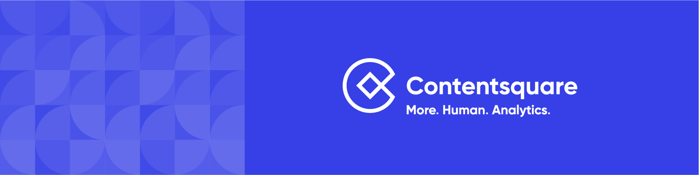

# 🎉 Welcome to the Contentsquare Capacitor Plugin sample apps

  

### Here you will find a sample applications that will show you how to use the Contentsquare Plugin for Capacitor and integrate it in your app.

## 🧐 Pick your choice of JavaScript Framework

* **[React](https://github.com/ContentSquare/capacitor-sample-app/tree/main/React)** - an Ionic Capacitor sample app that is built with React.
* **[Angular](https://github.com/ContentSquare/capacitor-sample-app/tree/main/Angular)** - an Ionic Capacitor sample app that is built with the Angular Framework and Capacitor 6.

Note: if your JavaScript Framework is not represented in our sample apps, please let us know.

## 📚 Docs

If you wish to learn more about the Contentsquare Capacitor Plugin, you can find its documentation [here](https://docs.contentsquare.com/capacitor).
